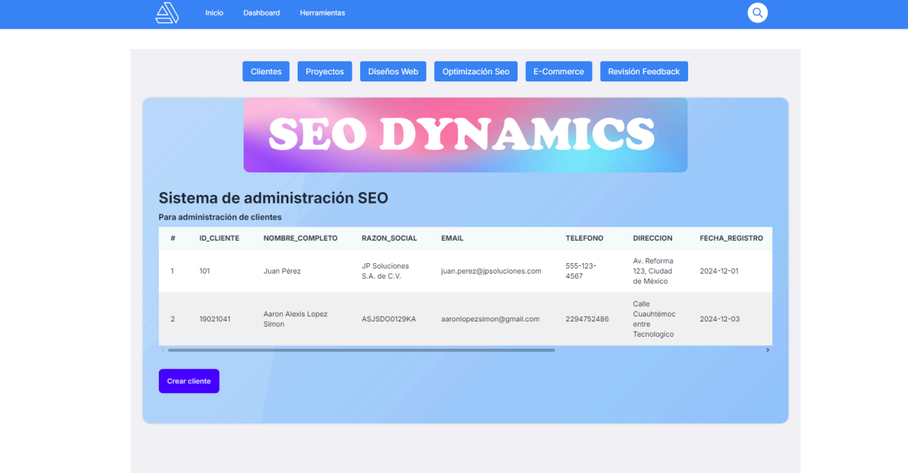
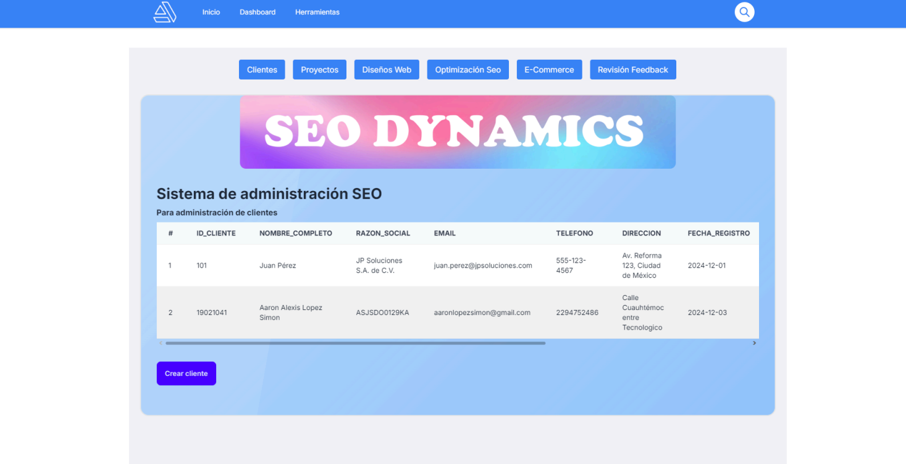
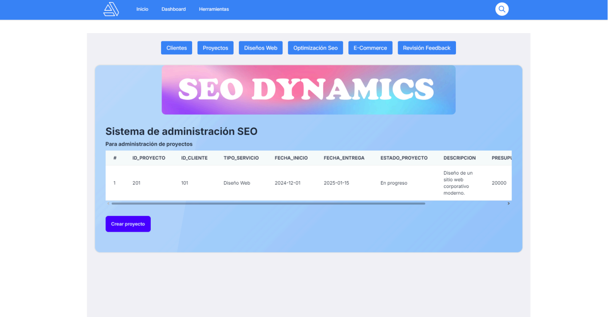
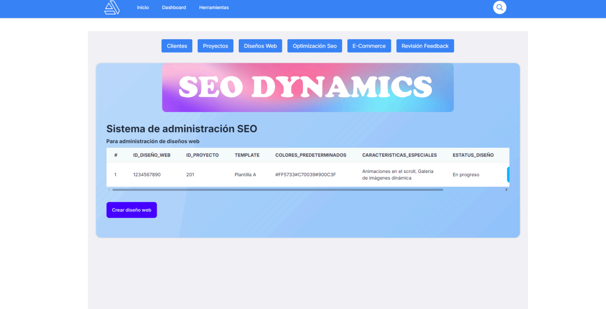
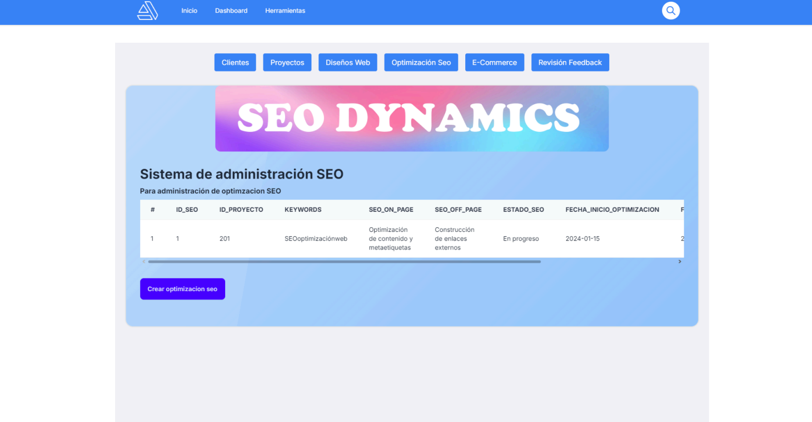
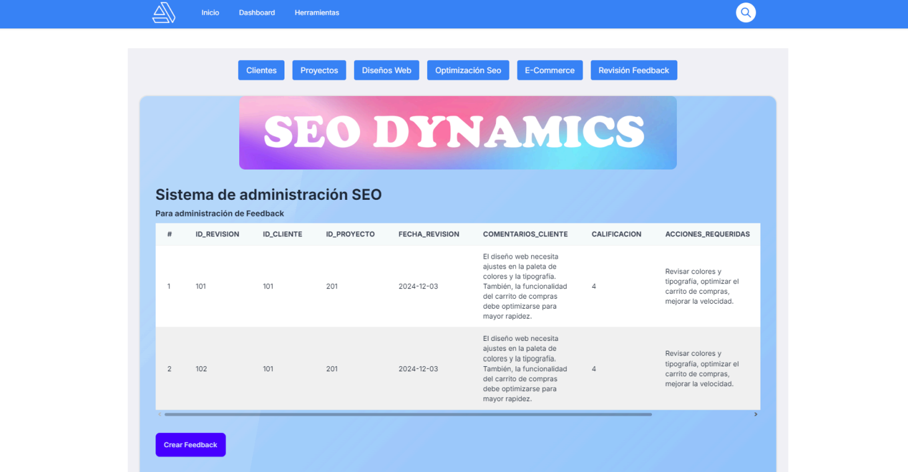

# SeoDynamics

Proyecto administrativo para la gestión de clientes, proyectos, diseños web, optimización SEO y e-commerce para microempresas en Veracruz.



---

## Índice

- [Descripción](#descripción)
- [Demo](#demo)
- [Tecnologías usadas](#tecnologías-usadas)
- [Características principales](#características-principales)
- [Esquema de Navegación](#esquema-de-navegación)
- [Modelos de Base de Datos](#modelos-de-base-de-datos)
- [Capturas de Pantalla](#capturas-de-pantalla)
- [Cómo usar](#cómo-usar)
- [Licencia](#licencia)

---

## Descripción

SeoDynamics es un sistema web con base de datos integrada que permite la creación, modificación, eliminación y visualización de clientes y proyectos, facilitando la administración y el crecimiento de microempresas mediante servicios de diseño web, SEO y e-commerce.

---

## Demo

[Ver demo en vivo](https://solubletexturepacks.com)

---

## Tecnologías usadas

- **Next.js**: Framework React para aplicaciones web modernas y optimizadas para SEO.
- **TailwindCSS**: Framework CSS utility-first para estilos rápidos y consistentes.
- **MongoDB**: Base de datos NoSQL flexible y escalable.
- **React**
- **Node.js**

---

## Características principales

- Registro y administración de clientes.
- Gestión de proyectos y servicios asociados.
- Panel de usuario para clientes.
- Backend administrativo para gestión interna.
- Administración de diseños web, optimización SEO y e-commerce.
- Sistema de revisión y feedback del cliente.
- Reportes de desempeño SEO y tráfico web.
- Soporte y asistencia al cliente.
- Configuración del sistema y gestión de usuarios.

---

## Esquema de Navegación

**Flujo lógico:**

1. **Página Principal** → Formulario de Entrada → Panel del Cliente  
   El cliente se registra y accede a su panel para gestionar proyectos.

2. **Panel del Cliente** → Formulario de Proyecto → Backend del Administrador  
   El cliente detalla su proyecto, que es gestionado por el equipo.

3. **Backend del Administrador** → Desarrollo y Optimización → Entregables Finales  
   El equipo trabaja en el proyecto y entrega resultados para revisión.

4. **Revisión Final** → Feedback → Actualización de Proyecto  
   El cliente proporciona feedback y el proyecto se ajusta si es necesario.

5. **Reportes SEO** → Soporte y Asistencia → Configuración Final  
   Se entregan reportes y recomendaciones, y el cliente recibe soporte continuo.

---

## Modelos de Base de Datos

**Cliente**
- id_cliente (PK)
- nombre_completo
- razon_social
- email
- telefono
- direccion
- fecha_registro
- presupuesto_estimado
- estado_cliente

**Proyecto**
- id_proyecto (PK)
- id_cliente (FK)
- tipo_servicio
- fecha_inicio
- fecha_entrega
- estado_proyecto
- descripcion
- presupuesto

**Diseño_Web**
- id_diseño_web (PK)
- id_proyecto (FK)
- template
- colores_predeterminados
- caracteristicas_especiales
- estatus_diseño

**Optimización_SEO**
- id_seo (PK)
- id_proyecto (FK)
- keywords
- seo_on_page
- seo_off_page
- estado_seo
- fecha_inicio_optimizacion
- fecha_revision_seo
- herramientas_seo
- cms_framework

**E-commerce**
- id_ecommerce (PK)
- id_proyecto (FK)
- plataforma
- productos_incluidos
- pasarelas_pago
- estado_ecommerce
- fecha_lanzamiento

**Revisión y Feedback**
- id_revision (PK)
- id_cliente (FK)
- id_proyecto (FK)
- fecha_revision
- comentarios_cliente
- calificacion
- acciones_requeridas

---

## Capturas de Pantalla

**Clientes:**  


**Proyectos:**  


**Diseños Web:**  


**Optimización SEO:**  


**E-Commerce:**  


**Revisión Feedback:**  


---

## Cómo usar

```bash
git clone https://github.com/tuusuario/tu-proyecto.git
cd tu-proyecto
npm install
npm start
```

---

## Licencia

Este proyecto está bajo la licencia MIT.
